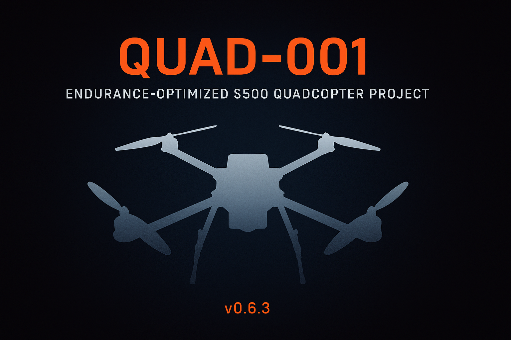

  

  
  
  

# Quad-001 — Endurance-Optimized S500 Quadcopter  
Version: **v0.6.3** (December 2025)

Quad-001 is a long-term engineering project to design, build, tune, and document a
high-efficiency 450–500 mm class quadcopter focused on endurance, stability,
and modular expandability. The project includes CAD parts, firmware configuration,
structural tuning, telemetry integration, and future autonomy and FPV improvements.

---

## 🛠️ Current Configuration (v0.6.3)

**Airframe**
- S500 frame (final decision locked)
- Carbon-fiber stiffeners + TPU/PLA vibration isolation
- Custom 4-piece landing-leg damper system
- New landing leg installed

**Propulsion**
- Motors: 3112-900 KV  
- Props: **APC 10 × 4.7** (current set installed)  
- Battery: 4S 5000 mAh LiPo  
- ESC: SkyStars KO60 BLHeli32 60A 4-in-1

**Flight Control**
- Matek H743-SLIM V3  
- GPS/Compass: HGLRC M100  
- Receiver: ExpressLRS RP4TD  
- Telemetry: **RFD900X** (MAVLink2, SERIAL6 @ 57 600 baud)

**Cameras / FPV (coming in v0.7)**
- Foxeer Razer Micro FPV camera  
- TBS Unify Pro32 HV VTX  
- Foxeer Lollipop Antenna  
- **RunCam Orange 5** (4K high-resolution recording camera)

---

## 🔗 Quick Component Reference (Web Links)

| Component | Model / Notes | Link |
|----------|----------------|------|
| **Frame** | S500 500 mm frame | https://www.amazon.com/s?k=S500+frame |
| **Motors** | 3112-900KV | https://www.amazon.com/s?k=3112+900kv+motor |
| **Props** | APC 10×4.7 SF | https://www.apcprop.com/product/10x4-7sf-b4/ |
| **ESC** | Skystars KO60 4-in-1 BLHeli32 | https://www.amazon.com/s?k=skystars+ko60 |
| **Flight Controller** | Matek H743-SLIM V3 | http://www.mateksys.com/?portfolio=h743-slim |
| **GPS / Compass** | HGLRC M100 | https://www.hglrc.com/products/hglrc-m100-mini-m8n-gps |
| **Receiver** | ExpressLRS RP4TD | https://www.expresslrs.org/receivers/rp4td/ |
| **Transmitter (RC)** | Radiomaster Boxer | https://www.radiomasterrc.com/products/boxer-radio-controller |
| **Telemetry Radio** | RFD900X | https://store.rfdesign.com.au/rfd-900x/ |
| **FPV Camera** | Foxeer Razer Micro | https://www.foxeer.com/foxeer-mini-standard-razer-fpv-camera-g-266 |
| **VTX** | TBS Unify Pro32 HV | https://team-blacksheep.com/shop/pro32hv |
| **Antenna** | Foxeer Lollipop | https://www.amazon.com/s?k=foxeer+lollipop |
| **HD Camera** | **RunCam Orange 5** | https://shop.runcam.com/runcam-5-orange/ |
| **Companion Computer** | Rpanion (Pi-based) | https://www.rpanion.com/software/rpanion-server/ |
| **ArduPilot Firmware** | ArduCopter | https://firmware.ardupilot.org/Copter/stable/ |

---

## 🚁 Project Status Summary

Quad-001 is structurally complete and in the late-tuning phase for v0.6.x:

- New APC 10×4.7 props installed  
- All 4 dampers + new landing leg installed  
- First stable flight on 10×4.7 completed (v0.6.3 milestone)  
- RFD900X MAVLink link fully operational  
- Initial FFT analysis complete (fundamental ~86 Hz)  
- Preparing for notch tuning, altitude-loop refinement, and rate-loop steps

The aircraft is now optimized for clean logs and ready for advanced tuning.

---

## 🧪 Tuning Progress (v0.6.x)

**Completed**
- Hover tests with 10×4.7 props  
- Initial FFT → fundamental ~86 Hz  
- Basic position hold tuning  
- RFD900 integration for live tuning  
- Leg dampers & structural stiffening  
- Baseline logs for rate loops and altitude behavior  

**Upcoming**
- Update harmonic notch filter using new FFT  
- Altitude-loop refinement  
- Step-response rate-loop flights  
- Autotune  
- Post-Autotune filter + PID verification  

---

## 🎥 FPV Integration (v0.7 milestone)

Planned tasks:
- Wire Foxeer camera → H743  
- Install TBS Unify Pro32 HV  
- Install and tune Lollipop antenna  
- Noise + EMI validation  
- Ground station receiver testing  
- Action cam mounting tests for **RunCam Orange 5**

---

## 🧭 Autonomy & Sensors (v0.8 milestone)

- Downward LiDAR (TF-Luna I2C preferred)  
- Enhanced altitude hold  
- AUTO missions  
- RTL refinement  
- Speed-limit switches via PSC_ANGLE_MAX  
- Companion-computer extensions (Rpanion, MAVLink routing, future apps)

---

## 🧱 CAD / Mechanical Design

Custom-designed and parametric components include:

- Arm stiffeners (TPU → CF → PLA sandwich)  
- Landing gear dampers  
- GPS mast  
- Battery tray  
- RFD900 mounting hardware  
- Prop guard experiments for 1047 props  
- Camera mount designs, including **RunCam Orange 5** mounting options  

---

## 🎯 Roadmap

**v0.6.x — Structural & Tuning**
- ✔ Frame upgrade  
- ✔ RFD900 integration  
- ✔ New props + dampening  
- ✔ Notch tuning  
- ✔ Rate/altitude tuning  
- ☐ Autotune  

**v0.7 — FPV**
- ☐ Camera + VTX integration  
- ☐ Antenna work  
- ☐ Ground station receiver  
- ☐ Wiring cleanup  
- ☐ RunCam mount + test flights  

**v0.8 — Autonomy**
- ☐ Downward LiDAR  
- ☐ AUTO missions  
- ☐ Advanced RTL  
- ☐ Speed limits  
- ☐ Companion-computer apps  

---

## 🧵 Serial Ports

### 🧭 Matek H743-SLIM UART Reference Guide

[H743-SLIM V3 IO Mapping Documentation](https://www.mateksys.com/?portfolio=h743-slim#tab-id-5)

| **GPIO Port Label** | **FC PAD LABEL** | **Typical Use** | **ArduPilot SERIALx** | **Protocol (value)** | **Baud** | **Notes / Tips** |
|----------------|------------------|-----------------|-----------------------|---------------|------------------|------------------|
| **USART1** | RX1/TX1 | 📈 Spare  | SERIAL2 | None (0) |  | Leave unused until you need it (set to device-specific later). |
| **USART2** | RX2/TX2 | 📡 GPS #1 | SERIAL3 | GPS (5)  | 230 | Pair with I²C compass on same GPS puck. |
| **USART3** | RX3/TX3 | 📈 Spare  | SERIAL4 | None (0) | | Leave unused until you need it (set to device-specific later). |
| **UART4**  | RX4/TX4 | 🛰 Telemetry / RFD900 | SERIAL6 | MAVLink (2) | 57 | Long-range radio. Provide dedicated 5 V ≥ 2 A BEC. |
| **USART6** | RX6/TX6 |  📈 Spare | SERIAL7 | None (0) |  | Leave unused until you need it (set to device-specific later).  |
| **UART7** | RX7/TX7 | 🎮 ELRS Receiver (CRSF) | SERIAL1 |  ELRS(23) | 420 | Express LRS (main receiver port). |
| **UART8** | RX8/TX8 | ESC Telemetry | SERIAL5 |  ESC Telemetry(16) | 115 | ESC Telemetry. |
| **USB**  | USB | 🔌 Ground Station | SERIAL0 | MAVLink (2) |  | Main setup + firmware loading port. |

---

## 📄 License

See `LICENSE` for details.

---

## ✨ Notes

Quad-001 is a long-term iterative engineering project.  
All CAD, firmware, wiring, and tuning details evolve alongside each milestone.
